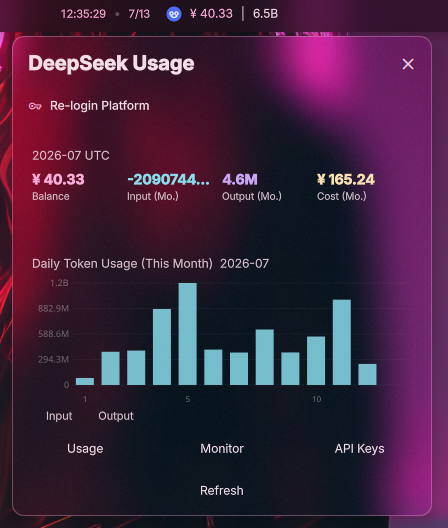

# DeepSeek API Widget

A [Dank Material Shell](https://github.com/Quickshell/DankMaterialShell) widget that displays your [DeepSeek Platform](https://platform.deepseek.com) API balance, token usage, and cost — right in your desktop bar.

## Features

- **Balance at a glance** — normal balance, bonus balance, and token estimation in the bar pill
- **Monthly breakdown** — input/output token counts and cost for the current month
- **Daily trend chart** — stacked bar chart of daily token usage with input/output split
- **Multi-month history** — configurable trend history up to 6 months
- **Cookie auto-login** — Playwright-powered Chromium browser automates platform login
- **i18n** — English and Simplified Chinese (中文)

## Screenshots
- 改前


- 改后


## Requirements

- [Dank Material Shell](https://github.com/Quickshell/DankMaterialShell) >= 0.1.0
- Python 3.8+
- pip / venv
- A desktop environment with a web browser (for the initial login)

## Installation

> **For AI agents:** see [llms.txt](./llms.txt) for structured install instructions.

### 1. Clone the plugin

```bash
mkdir -p ~/.config/DankMaterialShell/plugins
git clone https://github.com/suruibin/DeepSeekUsage.git \
  ~/.config/DankMaterialShell/plugins/DeepSeekWidget
```

### 2. Create a virtual environment

```bash
cd ~/.config/DankMaterialShell/plugins/DeepSeekWidget
python3 -m venv .venv
```

### 3. Install Python dependencies

```bash
.venv/bin/pip install -r scripts/requirements.txt
```

### 4. Install Chromium for Playwright

```bash
.venv/bin/playwright install chromium
```

> **Note:** Chromium requires certain system libraries. If installation fails, install them first:
> ```bash
> # Arch Linux
> sudo pacman -S --needed nss atk at-spi2-atk cups-libs libdrm libxkbcommon libxcomposite libxdamage libxrandr mesa gtk3 pango cairo alsa-lib
>
> # Ubuntu / Debian
> sudo apt install -y libnss3 libatk-bridge2.0-0 libcups2 libdrm2 libxkbcommon0 libxcomposite1 libxdamage1 libxrandr2 libgbm1 libpango-1.0-0 libcairo2 libasound2t64
>
> # Fedora
> sudo dnf install -y nss atk at-spi2-atk cups-libs libdrm libxkbcommon libxcomposite libXdamage libXrandr mesa-libgbm gtk3 pango cairo alsa-lib
> ```

### 5. Enable the widget

Edit `~/.config/DankMaterialShell/settings.json` and add `"deepseekWidget"` to your `barConfigs` array:

```json
{
  "barConfigs": [
    "deepseekWidget",
    "... other widgets ..."
  ]
}
```

Restart Dank Material Shell or reload the configuration for the widget to appear.

### 6. Log in

Click the widget in the bar, then click **Re-login Platform**. A Chromium window will open — log in with your DeepSeek Platform account. The browser closes automatically once authenticated.

### Python environment

This project uses an isolated virtual environment (`.venv`). Do not install into system Python unless you explicitly intend to.

### Cleanup after install

Once everything is working, you can remove files not needed at runtime to save space:

```bash
cd ~/.config/DankMaterialShell/plugins/DeepSeekWidget
rm -rf .git .gitignore .superpowers screenshots sync.sh README.md LICENSE llms.txt
```

Only these are required at runtime: `plugin.json`, `*.qml`, `i18n/`, `scripts/`, `.venv/`.

## Usage

### Login

1. Open the widget popout from the bar pill
2. Click **Re-login Platform**
3. A Chromium browser window opens — log in to [platform.deepseek.com](https://platform.deepseek.com)
4. Once logged in, the browser closes automatically and data loads

### Bar Pill

The compact bar display shows:

```
[DS]  ¥ 42.50 | 1.2M
```

- Balance in your account currency
- Total token usage for the current month

### Popout Panel

Click the bar pill to open the full panel with:
- Current month token/cost breakdown
- Daily usage trend chart
- Quick links to Usage, Monitoring, and API Keys pages
- Manual refresh button

### Settings

Configure via the DMS settings panel:
- **Refresh interval** — 1/5/15/30 minutes
- **Trend history months** — 1/3/6 months
- **Language** — English / 中文

## How It Works

The widget calls DeepSeek Platform's internal APIs using your session cookie:

| Endpoint | Purpose |
|----------|---------|
| `/api/v0/users/get_user_summary` | Balance, monthly summary |
| `/api/v0/usage/amount` | Token usage breakdown |
| `/api/v0/usage/cost` | Cost breakdown |

The cookie is obtained by launching a Chromium browser via Playwright, intercepting the authenticated request after you log in. The cookie is stored locally in `cookie.txt` (gitignored).

## Project Structure

```
├── plugin.json              # DMS plugin manifest
├── DeepSeekWidget.qml       # Main widget (bar pill + popout)
├── DeepSeekSettings.qml     # Settings panel
├── i18n/
│   ├── en_US.json           # English strings
│   └── zh_CN.json           # Chinese strings
├── scripts/
│   ├── fetch.py             # API data fetcher
│   ├── login.py             # Playwright cookie login
│   └── requirements.txt     # Python dependencies
└── sync.sh                  # Dev sync helper
```

## Changelog

### 2026-07-13 — Popup transparency support

- **Fixed:** All card backgrounds, button backgrounds, and borders in `DeepSeekWidget.qml` now respect DMS's global `Theme.popupTransparency` setting by using `Theme.withAlpha()` instead of solid `Theme.surfaceContainerHigh` / `Theme.surfaceContainer` colors.
- **Fixed:** Same transparency treatment applied to `DeepSeekSettings.qml` (cookie status card and prerequisites card).
- **Fixed:** Banner backgrounds ("not logged in", "auth expired") and Canvas chart grid/label colors now properly follow the popup transparency.
- **Note:** Canvas 2D API code was kept using `Qt.rgba()` rather than `Theme.withAlpha()` since the latter doesn't accept string color arguments.

### Modified files

| File | Changes |
|------|---------|
| `DeepSeekWidget.qml` | Login button bg/border, data card bg, chart card bg, link buttons bg, refresh button bg, banners, canvas grid/labels — all use `Theme.withAlpha()` with `popupTransparency` |
| `DeepSeekSettings.qml` | Cookie status card bg, prerequisites card bg — use `Theme.withAlpha()` with `popupTransparency` |

## License

MIT — see [LICENSE](./LICENSE) for details.

## Disclaimer

This project is not affiliated with or endorsed by DeepSeek. It uses DeepSeek Platform's internal APIs and may break if those APIs change.
